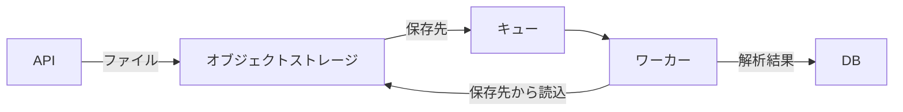

# Design Docの構成・失敗条件・代替案 — 1回目

[一覧へ](../report.md) · [ブラウザで左右比較](../comparison.html#design-tradeoff.1.final)

[原依頼](#prompt) · [スキルなし](#without-skill) · [スキルあり](#with-skill) · [採点理由](#judgments) · [初稿とlint指摘](#initial)

## 原依頼

実装者向けにファイル取込のDesign Docを作成して。確定した資料: APIはファイルをオブジェクトストレージへ保存し、その保存先をキューへ登録する。保存に失敗したら503を返し、キューには登録しない。ワーカーは保存先から読み、解析結果をDBへ保存する。キューへの登録失敗時の回復方法は未決定。ファイル本体をキューに載せる案は、10MBのファイルがキューの1MB制限を超えるため不採用。非同期化で利用者への結果提示が遅れる。進行メモ: DATA-64、PR #203、今週はAPI実装、担当佐藤。

## 最終稿

以下は保存された本文の全文。本文外の注記と採点は本文の後に分けて表示する。

### スキルなし

2/5基準合格 · 1646字 · lint指摘3件 · 初稿＝最終稿（修正なし）

[本文だけのMarkdown](../documents/design-tradeoff.1.without_skill.1.md)

---

# ファイル取込 Design Doc

## 1. 概要

APIで受け付けたファイルをオブジェクトストレージに保存し、保存先情報をキューへ登録する。ワーカーはキューから保存先を取得し、オブジェクトストレージ上のファイルを読み込んで解析し、解析結果をDBへ保存する。

ファイル本体をキューへ登録する方式は、最大10MBのファイルがキューの1MB制限を超えるため採用しない。

## 2. 対象範囲

- APIによるファイル受付
- オブジェクトストレージへの保存
- 保存先情報のキュー登録
- ワーカーによるファイル取得・解析
- 解析結果のDB保存
- 保存失敗時のAPIエラー処理

キューへの登録失敗時の回復方法は、現時点では未決定とする。

## 3. 処理フロー

1. クライアントがAPIへファイルを送信する。
2. APIがファイルをオブジェクトストレージへ保存する。
3. 保存に成功した場合、APIが保存先情報をキューへ登録する。
4. APIは受付結果を返す。解析は非同期で実行する。
5. ワーカーがキューから保存先情報を取得する。
6. ワーカーがオブジェクトストレージからファイルを読み込む。
7. ワーカーがファイルを解析する。
8. ワーカーが解析結果をDBへ保存する。

## 4. API仕様・エラー処理

### 4.1 保存成功時

オブジェクトストレージへの保存後に、保存先を示すキーまたはURIをキューへ登録する。APIレスポンスには、必要に応じて受付IDなど、非同期処理の状態を追跡できる識別子を含める。

### 4.2 保存失敗時

オブジェクトストレージへの保存に失敗した場合は、HTTP 503を返す。この場合、キューへの登録は行わない。

保存成功後にキュー登録が失敗した場合の回復方法は未決定であるため、実装前に以下を決定する必要がある。

- 再試行の有無と回数
- 再試行間隔およびバックオフ方式
- 未登録ファイルの検出方法
- 重複登録時の扱い
- 運用担当者による再処理方法

## 5. キューメッセージ

キューにはファイル本体を登録せず、少なくとも以下のメタデータを登録する。

- 受付IDまたはファイルID
- オブジェクトストレージ上の保存先キーまたはURI
- 必要に応じてファイル形式、サイズ、登録日時

保存先情報だけを登録することで、キューの1MB制限を回避する。最大10MBのファイル本体はオブジェクトストレージで扱う。

## 6. ワーカー処理

ワーカーはキューメッセージを受信後、保存先からファイルを読み込んで解析する。解析に成功した場合は、受付IDまたはファイルIDと紐付けて解析結果をDBへ保存する。

実装時には、少なくとも以下を考慮する。

- 保存先が存在しない場合のエラー処理
- 一時的な読み込み失敗時の再試行
- 同一メッセージの重複処理に対する冪等性
- 解析失敗時の状態記録と再処理方針
- DB保存失敗時に解析結果を失わない設計

## 7. 非同期処理に伴う利用者影響

解析を非同期化するため、ファイル受付から解析結果の提示までに遅延が発生する。利用者には受付完了と解析完了を区別して提示し、結果取得方法および処理状態を確認できる仕組みを用意する必要がある。

## 8. 未決定事項

- キュー登録失敗後の回復方法
- 解析処理の再試行および失敗時の扱い
- 処理状態を取得するAPIの詳細
- 解析完了通知の方式
- ファイル保持期間と削除タイミング

## 9. 実装計画

- 対象: DATA-64
- 関連PR: #203
- 今週の作業: API実装
- 担当: 佐藤

今週は、ファイルのオブジェクトストレージ保存、保存失敗時の503応答、保存先情報のキュー登録までを実装対象とする。キュー登録失敗時の回復仕様は、別途決定後に実装へ反映する。

---

**本文外の注記**

確定事項と未決定事項を分離して記載しました。キュー登録失敗時の回復方法は原資料どおり未決定としており、具体的な方式は断定していません。

### スキルあり

4/5基準合格 · 1194字 · lint指摘1件 · lintによる修正1回

[本文だけのMarkdown](../documents/design-tradeoff.1.with_skill.2.md)

---

# ファイル取込の設計

## 背景と目標

ファイル取込を非同期化し、APIが受け取ったファイルを保存して解析処理へ渡す。APIは保存先をキューへ登録し、ワーカーは解析結果をDBへ保存する。

## 対象と非対象

対象は、APIによるファイル保存、キュー登録、ワーカーによる解析、解析結果のDB保存である。ファイル本体をキューへ載せる方式は対象外とする。利用者への結果提示までの具体的な方法は、この資料の対象外である。

## 設計

### API

1. APIは受け取ったファイルをオブジェクトストレージへ保存する。
2. 保存先をキューへ登録する。
3. 保存に失敗した場合、APIは503を返し、キューへ登録しない。

### ワーカー

ワーカーはキューから保存先を受け取り、オブジェクトストレージからファイルを読み込む。解析結果をDBへ保存する。

### データの流れ

### 失敗時の動作

保存に失敗した場合、APIは503を返し、キューへ登録しない。キューへの登録に失敗した場合の回復方法は未決定である。

## 代替案と不採用理由

ファイル本体をキューへ載せる案は採用しない。キューの上限は1MBであり、対象ファイルの最大10MBを収容できないためである。

## 影響

非同期化により、解析結果が利用者に提示されるまで遅れる。ファイル本体をキューへ載せないため、キューには保存先を登録する。

## リスク

キューへの登録に失敗した場合の回復方法が未決定である。この未決定事項により、保存済みファイルを解析処理に渡せない場合の扱いが定まっていない。

## 到達範囲

### システムの到達範囲

API、オブジェクトストレージ、キュー、ワーカー、DBの連携を扱う。キューへの登録失敗後の回復方法は含まない。

### 手順の到達範囲

APIがファイルを保存し、保存先をキューへ登録する。ワーカーが保存先からファイルを読み、解析結果をDBへ保存する。運用上の復旧手順は、キューへの登録失敗時の回復方法が決まるまで定めない。

## 可逆性

ファイル本体をキューへ載せる方式へ変更する場合、キューの1MB制限により10MBのファイルを扱えない。そのため、現設計からの変更可否は、ファイルサイズとキュー制限を満たす別方式の検討を要する。

## 未解決点

- キューへの登録に失敗した場合の回復方法
- 非同期処理後の解析結果を利用者へ提示する方法

---

**本文外の注記**

Design Doc（stock）として、前稿の構成と原資料の意味を保ち、指摘された助詞の重複を修正しました。外部textlint・意味検査は実行していません。

## 採点基準と理由（最終稿のみ）

単一LLMの元判定で、採点の誤りを含む。[採点の照合メモ](../run-notes.md)も参照。

### 事実の保持（facts）

基準: API→ストレージ→保存先をキュー→ワーカー→DBの流れ、保存失敗503かつ登録しない条件、登録失敗回復の未決定、10MB対1MB、結果提示の遅れを残す。

**スキルなし: 合格**

必要な処理フロー、保存失敗時のHTTP 503およびキュー未登録、回復方法未決定、最大10MBとキュー1MB制限、非同期化による結果提示遅延を記載している。

**スキルあり: 合格**

API→オブジェクトストレージ→保存先をキュー→ワーカー→DBの流れ、保存失敗時の503とキュー未登録、キュー登録失敗時の回復未決定、10MBと1MB制限、結果提示の遅延を本文に記載している。

### 根拠のない補完を避ける（grounding）

基準: 再送・削除・通知・状態取得APIなど未記載の回復や仕様を確定事項として補わない。

**スキルなし: 不合格**

受付ID・状態追跡識別子、再試行・バックオフ、未登録検出、再処理、状態取得API、完了通知、削除タイミングなど、資料にない仕様・回復論点を本文へ具体的に追加している。

**スキルあり: 合格**

キュー登録失敗時の回復は未決定と明記し、再送・削除・通知・状態取得API等を確定仕様として補っていない。

### 文書の役割（role）

基準: 本文にDATA-64、PR #203、今週の作業や担当佐藤の追跡情報を入れない。

**スキルなし: 不合格**

「実装計画」にDATA-64、PR #203、今週のAPI実装、担当佐藤を本文へ記載している。

**スキルあり: 合格**

本文にDATA-64、PR #203、今週の作業、担当佐藤は記載されていない。

### 説明の明確さ（clarity）

基準: ストレージ保存失敗とキュー登録失敗を区別し、代替案を採らない理由が分かる。

**スキルなし: 合格**

ストレージ保存失敗時は503かつ未登録、保存後のキュー登録失敗時は回復未決定として区別し、不採用案の理由もサイズ制限で明示している。

**スキルあり: 合格**

ストレージ保存失敗時の503・未登録と、キュー登録失敗時の回復未決定を明確に区別している。ファイル本体を載せない理由も1MB制限と10MBファイルにより説明している。

### 簡潔さ（economy）

基準: 必要な論点の節や表は許容する。導入・概要・まとめで同じ結論を繰り返さず、空の節や依頼外の実装計画を付けない。

**スキルなし: 不合格**

依頼外の詳細なAPI仕様、ワーカー障害対応、状態・通知・削除の論点、実装計画を追加しており、必要な設計論点に絞れていない。

**スキルあり: 不合格**

同じ処理フロー、保存失敗時の扱い、キュー登録失敗時の未決定事項を複数節で反復し、「到達範囲」「可逆性」など依頼に不要な節も追加している。

## 初稿とlint指摘

初稿は意味の採点対象外。修正なしの場合、本文は上の最終稿と同一。行・列番号はリンク先の本文Markdownに対応する。

### スキルなし

#### 初稿＝最終稿（修正なし）

[本文Markdown](../documents/design-tradeoff.1.without_skill.1.md) · 1646字 · lint指摘3件

**no-vague-action — 35行 54列**

曖昧な動作の候補です。実施する条件・しない条件が前後の文から分かるか確認してください。否定・条件を保って見直してください。

**no-vague-action — 55行 3列**

曖昧な動作の候補です。実施する条件・しない条件が前後の文から分かるか確認してください。否定・条件を保って見直してください。

**stock-boundary — 85行 7列**

文書にJira課題IDが含まれています。作業追跡はチケットまたは進捗文書へ移してください。

### スキルあり

#### 初稿

[本文Markdown](../documents/design-tradeoff.1.with_skill.1.md) · 1194字 · lint指摘1件

# ファイル取込の設計

## 背景と目標

ファイル取込を非同期化し、APIが受け取ったファイルを保存して解析処理へ渡す。APIは保存先をキューへ登録し、ワーカーは解析結果をDBへ保存する。

## 対象と非対象

対象は、APIによるファイル保存、キュー登録、ワーカーによる解析、解析結果のDB保存である。ファイル本体をキューへ載せる方式は対象外とする。利用者への結果提示までの具体的な方法は、この資料の対象外である。

## 設計

### API

1. APIは受け取ったファイルをオブジェクトストレージへ保存する。
2. 保存先をキューへ登録する。
3. 保存に失敗した場合、APIは503を返し、キューへ登録しない。

### ワーカー

ワーカーはキューから保存先を受け取り、オブジェクトストレージからファイルを読み込む。解析結果をDBへ保存する。

### データの流れ

### 失敗時の動作

保存に失敗した場合、APIは503を返し、キューへ登録しない。キューへの登録に失敗した場合の回復方法は未決定である。

## 代替案と不採用理由

ファイル本体をキューへ載せる案は採用しない。キューの上限は1MBであり、対象ファイルの最大10MBを収容できないためである。

## 影響

非同期化により、解析結果が利用者に提示されるまで遅れる。ファイル本体をキューへ載せないため、キューには保存先を登録する。

## リスク

キューへの登録に失敗した場合の回復方法が未決定である。この未決定事項により、保存済みファイルを解析処理へ渡せない場合の扱いが定まっていない。

## 到達範囲

### システムの到達範囲

API、オブジェクトストレージ、キュー、ワーカー、DBの連携を扱う。キューへの登録失敗後の回復方法は含まない。

### 手順の到達範囲

APIがファイルを保存し、保存先をキューへ登録する。ワーカーが保存先からファイルを読み、解析結果をDBへ保存する。運用上の復旧手順は、キューへの登録失敗時の回復方法が決まるまで定めない。

## 可逆性

ファイル本体をキューへ載せる方式へ変更する場合、キューの1MB制限により10MBのファイルを扱えない。そのため、現設計からの変更可否は、ファイルサイズとキュー制限を満たす別方式の検討を要する。

## 未解決点

- キューへの登録に失敗した場合の回復方法
- 非同期処理後の解析結果を利用者へ提示する方法

**本文外の注記**

Design Doc（stock）として、実装者向けに構成を検査して執筆。確定資料にない進行メモ（DATA-64、PR #203、担当者、今週の作業）は本文から除外。外部のlint・意味検査は未実施。

**no-doubled-joshi — 62行 17列**

一文に二回以上利用されている助詞 "へ" がみつかりました。

次の助詞が連続しているため、文を読みにくくしています。

- "へ"
- "へ"

同じ助詞を連続して利用しない、文の中で順番を入れ替える、文を分割するなどを検討してください。

#### 最終稿

[本文Markdown](../documents/design-tradeoff.1.with_skill.2.md) · 1194字 · lint指摘1件

**no-doubled-joshi — 62行 17列**

一文に二回以上利用されている助詞 "へ" がみつかりました。

次の助詞が連続しているため、文を読みにくくしています。

- "へ"
- "へ"

同じ助詞を連続して利用しない、文の中で順番を入れ替える、文を分割するなどを検討してください。

