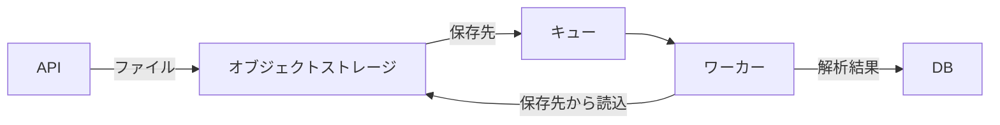

# ファイル取込の設計

## 背景と目標

ファイル取込を非同期化し、APIが受け取ったファイルを保存して解析処理へ渡す。APIは保存先をキューへ登録し、ワーカーは解析結果をDBへ保存する。

## 対象と非対象

対象は、APIによるファイル保存、キュー登録、ワーカーによる解析、解析結果のDB保存である。ファイル本体をキューへ載せる方式は対象外とする。利用者への結果提示までの具体的な方法は、この資料の対象外である。

## 設計

### API

1. APIは受け取ったファイルをオブジェクトストレージへ保存する。
2. 保存先をキューへ登録する。
3. 保存に失敗した場合、APIは503を返し、キューへ登録しない。

### ワーカー

ワーカーはキューから保存先を受け取り、オブジェクトストレージからファイルを読み込む。解析結果をDBへ保存する。

### データの流れ

### 失敗時の動作

保存に失敗した場合、APIは503を返し、キューへ登録しない。キューへの登録に失敗した場合の回復方法は未決定である。

## 代替案と不採用理由

ファイル本体をキューへ載せる案は採用しない。キューの上限は1MBであり、対象ファイルの最大10MBを収容できないためである。

## 影響

非同期化により、解析結果が利用者に提示されるまで遅れる。ファイル本体をキューへ載せないため、キューには保存先を登録する。

## リスク

キューへの登録に失敗した場合の回復方法が未決定である。この未決定事項により、保存済みファイルを解析処理に渡せない場合の扱いが定まっていない。

## 到達範囲

### システムの到達範囲

API、オブジェクトストレージ、キュー、ワーカー、DBの連携を扱う。キューへの登録失敗後の回復方法は含まない。

### 手順の到達範囲

APIがファイルを保存し、保存先をキューへ登録する。ワーカーが保存先からファイルを読み、解析結果をDBへ保存する。運用上の復旧手順は、キューへの登録失敗時の回復方法が決まるまで定めない。

## 可逆性

ファイル本体をキューへ載せる方式へ変更する場合、キューの1MB制限により10MBのファイルを扱えない。そのため、現設計からの変更可否は、ファイルサイズとキュー制限を満たす別方式の検討を要する。

## 未解決点

- キューへの登録に失敗した場合の回復方法
- 非同期処理後の解析結果を利用者へ提示する方法
