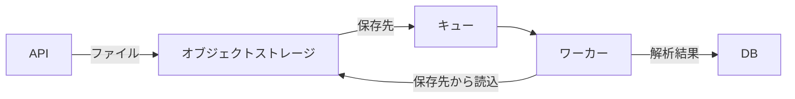

# Design Docの構成・失敗条件・代替案 — 1回目の文書レビュー

[一覧](../report.md) · [左右比較](../comparison.html#design-tradeoff.1)

これは単一モデルによる文書レビューで、正解ラベルではありません。引用の完全一致は機械検証しますが、指摘の解釈や重大度が正しいことは保証しません。原資料の不足と執筆上の欠陥を分け、見出し・表・短さだけでは判定しません。

## 原依頼・原資料

実装者向けにファイル取込のDesign Docを作成して。確定した資料: APIはファイルをオブジェクトストレージへ保存し、その保存先をキューへ登録する。保存に失敗したら503を返し、キューには登録しない。ワーカーは保存先から読み、解析結果をDBへ保存する。キューへの登録失敗時の回復方法は未決定。ファイル本体をキューに載せる案は、10MBのファイルがキューの1MB制限を超えるため不採用。非同期化で利用者への結果提示が遅れる。進行メモ: DATA-64、PR #203、今週はAPI実装、担当佐藤。

文書種別: Design Doc

読み手の視点: 実装者として、構成、処理とデータの流れ、重要な失敗条件、制約、不採用案の理由、未決定の範囲を理解できるかを読む。資料だけでは決まらない設計は確認事項とし、架空の実装詳細を要求しない。

## スキルなし

### レビュー

**文書の修正が必要**

基本構成と保存失敗時の処理は理解できます。ただし、資料にないファイルサイズ上限と識別子の必須化を修正する必要があります。キュー登録失敗時の回復などは、追加決定なしには実装を確定できません。

想定用途: 実装者がファイル取込の構成、データフロー、失敗条件、制約、未決定事項を理解するためのDesign Doc。

#### 良い点

- API、オブジェクトストレージ、キュー、ワーカー、DBの処理順序が明確です。
- 保存失敗時の503応答とキューへ登録しない条件を正確に示しています。
- キュー登録失敗時の回復を未決定と明示し、確認すべき論点を具体化しています。

#### 指摘

**1. 要修正 — 原資料の10MBはキュー制限を超えるファイルの大きさであり、受付可能な最大サイズとは定められていません。本文では概要とキューメッセージの節で上限に変わっています。**

根拠: 原資料との整合性

本文の該当箇所:

> 最大10MBのファイルがキューの1MB制限を超えるため採用しない。

原資料の該当箇所:

> ファイル本体をキューに載せる案は、10MBのファイルがキューの1MB制限を超えるため不採用。

読み手への影響: 実装者が10MBを受付上限としてバリデーションやテストを実装し、本来受け付けるべきファイルを拒否するおそれがあります。

修正案: 両箇所の「最大」を削除し、受付サイズ上限が必要なら別の確認事項として扱ってください。

**2. 要修正 — 原資料で確定しているキューの内容は保存先です。本文は受付IDまたはファイルIDを必須項目に追加し、ワーカー処理でもそのIDと解析結果を紐付ける仕様を確定事項として記載しています。**

根拠: 原資料との整合性

本文の該当箇所:

> キューにはファイル本体を登録せず、少なくとも以下のメタデータを登録する。
> 
> - 受付IDまたはファイルID
> - オブジェクトストレージ上の保存先キーまたはURI

原資料の該当箇所:

> APIはファイルをオブジェクトストレージへ保存し、その保存先をキューへ登録する。

読み手への影響: 未合意の識別子を前提に、メッセージ形式、ID発行処理、DBの保存形式を実装してしまう可能性があります。

修正案: 保存先以外の識別子とDBでの紐付けは設計案または確認事項と明示し、APIレスポンスの識別子についても同じ位置付けに揃えてください。

#### 原資料に足りない情報

**保存成功後のキュー登録失敗に対する回復方法と、その場合のAPI応答。**

用途の達成を妨げる: はい · 本文で適切に扱う: はい

> 保存成功後にキュー登録が失敗した場合の回復方法は未決定であるため、実装前に以下を決定する必要がある。

正常系と保存失敗系は実装できますが、キュー登録失敗時のAPI動作と未処理ファイルの救済は確定できません。

**ワーカーの読み込み・解析・DB保存失敗時の扱い、および利用者への結果提示方法。**

用途の達成を妨げる: はい · 本文で適切に扱う: はい

> ## 8. 未決定事項

本文は考慮事項や未決定事項として示していますが、障害時の処理と結果提示を含む取込機能全体の実装確定には追加の設計判断が必要です。

### 成果物の全文

[本文だけのMarkdown](../artifacts/design-tradeoff.1.without_skill.md)

---

# ファイル取込 Design Doc

## 1. 概要

APIで受け付けたファイルをオブジェクトストレージに保存し、保存先情報をキューへ登録する。ワーカーはキューから保存先を取得し、オブジェクトストレージ上のファイルを読み込んで解析し、解析結果をDBへ保存する。

ファイル本体をキューへ登録する方式は、最大10MBのファイルがキューの1MB制限を超えるため採用しない。

## 2. 対象範囲

- APIによるファイル受付
- オブジェクトストレージへの保存
- 保存先情報のキュー登録
- ワーカーによるファイル取得・解析
- 解析結果のDB保存
- 保存失敗時のAPIエラー処理

キューへの登録失敗時の回復方法は、現時点では未決定とする。

## 3. 処理フロー

1. クライアントがAPIへファイルを送信する。
2. APIがファイルをオブジェクトストレージへ保存する。
3. 保存に成功した場合、APIが保存先情報をキューへ登録する。
4. APIは受付結果を返す。解析は非同期で実行する。
5. ワーカーがキューから保存先情報を取得する。
6. ワーカーがオブジェクトストレージからファイルを読み込む。
7. ワーカーがファイルを解析する。
8. ワーカーが解析結果をDBへ保存する。

## 4. API仕様・エラー処理

### 4.1 保存成功時

オブジェクトストレージへの保存後に、保存先を示すキーまたはURIをキューへ登録する。APIレスポンスには、必要に応じて受付IDなど、非同期処理の状態を追跡できる識別子を含める。

### 4.2 保存失敗時

オブジェクトストレージへの保存に失敗した場合は、HTTP 503を返す。この場合、キューへの登録は行わない。

保存成功後にキュー登録が失敗した場合の回復方法は未決定であるため、実装前に以下を決定する必要がある。

- 再試行の有無と回数
- 再試行間隔およびバックオフ方式
- 未登録ファイルの検出方法
- 重複登録時の扱い
- 運用担当者による再処理方法

## 5. キューメッセージ

キューにはファイル本体を登録せず、少なくとも以下のメタデータを登録する。

- 受付IDまたはファイルID
- オブジェクトストレージ上の保存先キーまたはURI
- 必要に応じてファイル形式、サイズ、登録日時

保存先情報だけを登録することで、キューの1MB制限を回避する。最大10MBのファイル本体はオブジェクトストレージで扱う。

## 6. ワーカー処理

ワーカーはキューメッセージを受信後、保存先からファイルを読み込んで解析する。解析に成功した場合は、受付IDまたはファイルIDと紐付けて解析結果をDBへ保存する。

実装時には、少なくとも以下を考慮する。

- 保存先が存在しない場合のエラー処理
- 一時的な読み込み失敗時の再試行
- 同一メッセージの重複処理に対する冪等性
- 解析失敗時の状態記録と再処理方針
- DB保存失敗時に解析結果を失わない設計

## 7. 非同期処理に伴う利用者影響

解析を非同期化するため、ファイル受付から解析結果の提示までに遅延が発生する。利用者には受付完了と解析完了を区別して提示し、結果取得方法および処理状態を確認できる仕組みを用意する必要がある。

## 8. 未決定事項

- キュー登録失敗後の回復方法
- 解析処理の再試行および失敗時の扱い
- 処理状態を取得するAPIの詳細
- 解析完了通知の方式
- ファイル保持期間と削除タイミング

## 9. 実装計画

- 対象: DATA-64
- 関連PR: #203
- 今週の作業: API実装
- 担当: 佐藤

今週は、ファイルのオブジェクトストレージ保存、保存失敗時の503応答、保存先情報のキュー登録までを実装対象とする。キュー登録失敗時の回復仕様は、別途決定後に実装へ反映する。

---

## スキルあり

### レビュー

**文書の修正が必要**

基本フローと未決定事項の把握には使えるが、図のキュー登録主体と、10MBをファイルサイズ上限とする記述は実装前に修正が必要。キュー登録失敗時の回復方法は別途設計判断が必要である。

想定用途: 実装者がファイル取込の構成、処理・データの流れ、失敗条件、制約、不採用理由、未決定事項を理解するためのDesign Doc。

#### 良い点

- 本文ではAPI、ストレージ、キュー、ワーカー、DBの役割と処理順序を説明している。
- 保存失敗時の503応答とキューへ登録しない条件を明記している。
- キュー登録失敗時の回復方法を未決定と明示し、保存済みファイルを解析へ渡せないリスクを説明している。

#### 指摘

**1. 要修正 — データフロー図ではストレージからキューへ保存先を渡しており、APIが登録するという確定仕様および本文と一致していない。**

根拠: 原資料との整合性

本文の該当箇所:

> B -->|保存先| C[キュー]

原資料の該当箇所:

> APIはファイルをオブジェクトストレージへ保存し、その保存先をキューへ登録する。

読み手への影響: 実装者がストレージ側のイベント通知などによるキュー登録を想定し、APIの責務や登録失敗を扱う箇所を誤る可能性がある。

修正案: 保存先をキューへ登録する矢印の起点をAPIに変更し、ファイル保存成功後に登録する関係を図でも示す。

**2. 要修正 — 原資料にある10MBのファイルを、対象ファイルの最大サイズへと意味を変えている。受入サイズの上限は資料では確定していない。**

根拠: 原資料との整合性

本文の該当箇所:

> 対象ファイルの最大10MB

原資料の該当箇所:

> ファイル本体をキューに載せる案は、10MBのファイルがキューの1MB制限を超えるため不採用。

読み手への影響: 実装者が10MBを入力検証や容量設計の確定上限として採用し、それを超えるファイルを誤って拒否する可能性がある。

修正案: 最大サイズという断定を除き、10MBのファイルがキューの1MB制限を超えることを不採用理由として記載する。

#### 原資料に足りない情報

**キューへの登録失敗時の回復方法。**

用途の達成を妨げる: はい · 本文で適切に扱う: はい

> キューへの登録に失敗した場合の回復方法は未決定である。

正常系の理解は可能だが、保存済みファイルを解析へ確実に引き渡すための失敗時処理は、この資料だけでは実装を確定できない。

**非同期処理後の解析結果を利用者へ提示する方法。**

用途の達成を妨げる: いいえ · 本文で適切に扱う: はい

> - 非同期処理後の解析結果を利用者へ提示する方法

取込からDB保存までの設計理解は妨げないが、利用者が結果を取得する機能の実装には追加の設計判断が必要である。

**受け入れるファイルサイズの上限。**

用途の達成を妨げる: いいえ · 本文で適切に扱う: いいえ

> 対象ファイルの最大10MB

10MBを確定上限として扱う根拠はなく、サイズ制限を実装する場合は別途確認が必要である。

### 成果物の全文

[本文だけのMarkdown](../artifacts/design-tradeoff.1.with_skill.md)

---

# ファイル取込の設計

## 背景と目標

ファイル取込を非同期化し、APIが受け取ったファイルを保存して解析処理へ渡す。APIは保存先をキューへ登録し、ワーカーは解析結果をDBへ保存する。

## 対象と非対象

対象は、APIによるファイル保存、キュー登録、ワーカーによる解析、解析結果のDB保存である。ファイル本体をキューへ載せる方式は対象外とする。利用者への結果提示までの具体的な方法は、この資料の対象外である。

## 設計

### API

1. APIは受け取ったファイルをオブジェクトストレージへ保存する。
2. 保存先をキューへ登録する。
3. 保存に失敗した場合、APIは503を返し、キューへ登録しない。

### ワーカー

ワーカーはキューから保存先を受け取り、オブジェクトストレージからファイルを読み込む。解析結果をDBへ保存する。

### データの流れ

### 失敗時の動作

保存に失敗した場合、APIは503を返し、キューへ登録しない。キューへの登録に失敗した場合の回復方法は未決定である。

## 代替案と不採用理由

ファイル本体をキューへ載せる案は採用しない。キューの上限は1MBであり、対象ファイルの最大10MBを収容できないためである。

## 影響

非同期化により、解析結果が利用者に提示されるまで遅れる。ファイル本体をキューへ載せないため、キューには保存先を登録する。

## リスク

キューへの登録に失敗した場合の回復方法が未決定である。この未決定事項により、保存済みファイルを解析処理に渡せない場合の扱いが定まっていない。

## 到達範囲

### システムの到達範囲

API、オブジェクトストレージ、キュー、ワーカー、DBの連携を扱う。キューへの登録失敗後の回復方法は含まない。

### 手順の到達範囲

APIがファイルを保存し、保存先をキューへ登録する。ワーカーが保存先からファイルを読み、解析結果をDBへ保存する。運用上の復旧手順は、キューへの登録失敗時の回復方法が決まるまで定めない。

## 可逆性

ファイル本体をキューへ載せる方式へ変更する場合、キューの1MB制限により10MBのファイルを扱えない。そのため、現設計からの変更可否は、ファイルサイズとキュー制限を満たす別方式の検討を要する。

## 未解決点

- キューへの登録に失敗した場合の回復方法
- 非同期処理後の解析結果を利用者へ提示する方法

---
