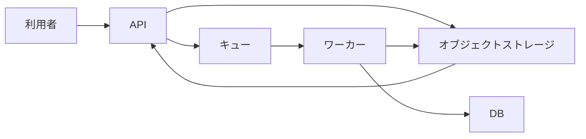

# Design Docの構成・失敗条件・代替案 — 1回目

[一覧へ](../report.md) · [ブラウザで左右比較](../comparison.html#design-tradeoff.1.final)

[原依頼](#prompt) · [スキルなし](#without-skill) · [スキルあり](#with-skill) · [採点理由](#judgments) · [初稿とlint指摘](#initial)

## 原依頼

実装者向けにファイル取込のDesign Docを作成して。確定した資料: APIはファイルをオブジェクトストレージへ保存し、その保存先をキューへ登録する。保存に失敗したら503を返し、キューには登録しない。ワーカーは保存先から読み、解析結果をDBへ保存する。キューへの登録失敗時の回復方法は未決定。ファイル本体をキューに載せる案は、10MBのファイルがキューの1MB制限を超えるため不採用。非同期化で利用者への結果提示が遅れる。進行メモ: DATA-64、PR #203、今週はAPI実装、担当佐藤。

## 最終稿

以下は保存された本文の全文。本文外の注記と採点は本文の後に分けて表示する。

### スキルなし

2/5基準合格 · 994字 · lint指摘0件 · lintによる修正1回

[本文だけのMarkdown](../documents/design-tradeoff.1.without_skill.2.md)

---

# ファイル取込 Design Doc

## 1. 概要

ファイル取込は非同期処理として実装する。APIは受信したファイルをオブジェクトストレージへ保存し、保存先情報をキューへ登録する。ワーカーはキューから保存先情報を取得し、ファイルを読み込んで解析結果をDBへ保存する。

## 2. 背景・制約

- ファイル本体をキューへ登録する方式は採用しない。
- 10MBのファイルに対して、キューのサイズ上限が1MBであるため。
- 非同期化により、利用者が解析結果を確認するまでの時間は従来より長くなる。

## 3. 処理フロー

### API

1. APIがファイルを受信する。
2. ファイルをオブジェクトストレージへ保存する。
3. 保存先情報をキューへ登録する。
4. 上記が完了したら、受付済みとしてレスポンスを返す。

### ワーカー

1. キューから保存先情報を取得する。
2. 保存先からファイル本体を読み込む。
3. ファイルを解析する。
4. 解析結果をDBへ保存する。

## 4. エラー処理

### オブジェクトストレージへの保存失敗

- APIは503を返す。
- キューには登録しない。

### キューへの登録失敗

回復方法は未決定である。実装前に、再試行、状態管理、運用による復旧などの方針を決定する。キュー登録に失敗した場合は、オブジェクトストレージ上のファイルを孤立させない仕組みも検討する。

## 5. データと責務

- オブジェクトストレージ: 受信したファイル本体を保持する。
- キュー: オブジェクトストレージ上の保存先情報を伝達する。ファイル本体は保持しない。
- ワーカー: ファイルの取得、解析、解析結果のDB保存を担当する。
- DB: 解析結果を保存する。

## 6. 実装前の確認事項

- キューへ登録する保存先情報の形式を定義する。
- APIの受付成功レスポンスと結果取得方法を定義する。
- 解析中、解析完了、解析失敗などの処理状態を管理するか決定する。
- キュー登録失敗時の回復方法を決定する。
- 非同期処理によって結果提示が遅れることを利用者へ伝える方法を決定する。

## 7. 今回のスコープ

今週はAPI実装を行う。担当は佐藤。課題およびレビュー状況は、進捗管理資料を参照する。

---

**本文外の注記**

関連する進捗情報はDATA-64およびPR #203。キュー登録失敗時の回復方法は原資料上未決定のため、設計上の未決事項として明記しています。

### スキルあり

4/5基準合格 · 1340字 · lint指摘0件 · 初稿＝最終稿（修正なし）

[本文だけのMarkdown](../documents/design-tradeoff.1.with_skill.1.md)

---

# ファイル取込の設計

ファイル本体をオブジェクトストレージに保存し、保存先をキューでワーカーへ渡して解析結果をDBに保存する。10MBのファイルをキューへ直接載せず、APIと解析処理を非同期化する。

## 背景

ファイル解析をAPIの処理から分離するため、APIはファイルを保存して解析処理を登録し、ワーカーが保存済みのファイルを解析する。非同期化により、利用者が解析結果を確認できるまで遅延する。

## 目標と非目標

### 目標

- APIがファイル本体をオブジェクトストレージへ保存する。
- APIが保存先をキューへ登録する。
- ワーカーが保存先からファイルを読み、解析結果をDBへ保存する。
- ファイル保存に失敗した場合、APIが503を返し、キューへ登録しない。

### 非目標

ファイル保存後にキューへの登録が失敗した場合の回復方法は、この資料では決定しない。

## 設計

### APIの処理

1. APIがファイルをオブジェクトストレージへ保存する。
2. 保存に失敗した場合、APIは503を返す。この場合、APIは保存先をキューへ登録しない。
3. 保存に成功した場合、APIは保存先をキューへ登録する。

ファイル本体はキューへ登録しない。10MBのファイルがキューの1MB制限を超えるためである。

### ワーカーの処理

1. ワーカーがキューから保存先を受け取る。
2. ワーカーが保存先からファイルを読み込む。
3. ワーカーがファイルを解析する。
4. ワーカーが解析結果をDBへ保存する。

### データの流れ

## 代替案と不採用理由

ファイル本体をキューへ登録する案は採用しない。10MBのファイルがキューの1MB制限を超えるためである。保存先だけをキューへ登録し、ワーカーがオブジェクトストレージからファイル本体を読む。

## 影響

解析を非同期化するため、利用者への解析結果の提示は遅れる。ファイル本体をキューへ載せないため、キューには保存先を登録する。

## リスク

APIがオブジェクトストレージへの保存に成功した後、キューへの登録に失敗した場合の回復方法が未決定である。この場合の扱いは、追加で決定する必要がある。

## 到達範囲

### システムの到達範囲

API、オブジェクトストレージ、キュー、ワーカー、DBを対象とする。APIが保存先をキューへ登録し、ワーカーが解析結果をDBへ保存するまでを扱う。

### 手順の到達範囲

ファイル保存、保存先のキュー登録、ワーカーによる読み込み、解析結果のDB保存を扱う。キューへの登録失敗後の回復手順は未決定である。

## 可逆性

保存先をキューへ登録する方式を変更する場合の具体的な切り戻し方法は、資料で定められていない。

---

**本文外の注記**

型: Design Doc（stock）。読者: 実装者。主題: ファイル本体をオブジェクトストレージに保存し、保存先をキューで渡して非同期解析する。構成はDesign Docの最小内容に合わせた親子構成。出典は依頼文の「確定した資料」および「進行メモ」だが、進行メモ（DATA-64、PR #203、今週の作業、担当者）は設計の正本ではないため本文から除外した。委譲・ファイル操作・lint実行は行っていないため、検査結果は未検証。

## 採点基準と理由（最終稿のみ）

単一LLMの元判定で、採点の誤りを含む。[採点の照合メモ](../../../findings.md)も参照。

### 事実の保持（facts）

基準: API→ストレージ→保存先をキュー→ワーカー→DBの流れ、保存失敗503かつ登録しない条件、登録失敗回復の未決定、10MB対1MB、結果提示の遅れを残す。

**スキルなし: 合格**

必要な処理フロー、保存失敗時の503・キュー非登録、キュー登録失敗時の回復未決定、10MB対1MBの制限、非同期化による結果提示の遅れを記載している。

**スキルあり: 合格**

API→ストレージ→保存先をキュー→ワーカー→DB、保存失敗時の503・非登録、キュー登録失敗時の回復未決定、10MBと1MB制限、結果提示の遅延をすべて本文に記載している。

### 根拠のない補完を避ける（grounding）

基準: 再送・削除・通知・状態取得APIなど未記載の回復や仕様を確定事項として補わない。

**スキルなし: 不合格**

原資料にない受付成功レスポンス、再試行・状態管理・運用復旧、孤立ファイル対策、結果取得方法、状態管理、利用者への伝達方法を実装前の仕様検討事項として追加している。

**スキルあり: 合格**

再送、削除、通知、状態取得などを確定仕様として追加していない。キュー登録失敗後の扱いは未決定としている。

### 文書の役割（role）

基準: 本文にDATA-64、PR #203、今週の作業や担当佐藤の追跡情報を入れない。

**スキルなし: 不合格**

本文の「今回のスコープ」に「今週はAPI実装」「担当は佐藤」と進行メモ由来の追跡情報を記載している。

**スキルあり: 合格**

本文にはDATA-64、PR #203、今週の作業、佐藤担当の追跡情報を含めていない。

### 説明の明確さ（clarity）

基準: ストレージ保存失敗とキュー登録失敗を区別し、代替案を採らない理由が分かる。

**スキルなし: 合格**

ストレージ保存失敗とキュー登録失敗を別節で区別し、本体をキューに載せない10MB対1MBの理由も明確である。

**スキルあり: 合格**

ストレージ保存失敗時の503・キュー非登録と、保存成功後のキュー登録失敗時の未決定事項を明確に区別している。10MBが1MB制限を超えるため本体をキューに載せない理由も明示されている。

### 簡潔さ（economy）

基準: 必要な論点の節や表は許容する。導入・概要・まとめで同じ結論を繰り返さず、空の節や依頼外の実装計画を付けない。

**スキルなし: 不合格**

依頼外の実装前確認事項としてレスポンス、結果取得、状態管理、通知方法などを列挙しており、必要な設計記述を超えた実装計画を付加している。

**スキルあり: 不合格**

同じ処理フローや結論を導入、背景、目標、設計、データの流れ、代替案、影響、到達範囲で繰り返しており、必要以上に重複している。

## 初稿とlint指摘

初稿は意味の採点対象外。修正なしの場合、本文は上の最終稿と同一。行・列番号はリンク先の本文Markdownに対応する。

### スキルなし

#### 初稿

[本文Markdown](../documents/design-tradeoff.1.without_skill.1.md) · 999字 · lint指摘4件

# ファイル取込 Design Doc

## 1. 概要

ファイル取込を非同期処理として実装する。APIは受信したファイルをオブジェクトストレージへ保存し、保存先情報をキューへ登録する。ワーカーはキューから保存先を取得してファイルを読み込み、解析結果をDBへ保存する。

## 2. 背景・制約

- ファイル本体をキューへ登録する方式は採用しない。
- 10MBのファイルに対して、キューのサイズ上限が1MBであるため。
- 非同期化により、利用者が解析結果を確認できるまでの時間は従来より遅くなる。

## 3. 処理フロー

### API

1. APIがファイルを受信する。
2. ファイルをオブジェクトストレージへ保存する。
3. 保存先を示す情報をキューへ登録する。
4. 成功時、受付済みとしてレスポンスを返す。

### ワーカー

1. キューから保存先情報を取得する。
2. 保存先からファイル本体を読み込む。
3. ファイルを解析する。
4. 解析結果をDBへ保存する。

## 4. エラー処理

### オブジェクトストレージへの保存失敗

- APIは503を返す。
- キューには登録しない。

### キューへの登録失敗

回復方法は未決定である。実装前に、再試行、状態管理、運用による復旧などの方針を決定する必要がある。キュー登録に失敗した場合に、オブジェクトストレージ上のファイルを孤立させない仕組みも検討対象とする。

## 5. データ・責務

- オブジェクトストレージ: 受信したファイル本体を保持する。
- キュー: オブジェクトストレージ上の保存先情報を伝達する。ファイル本体は保持しない。
- ワーカー: ファイルの取得、解析、解析結果のDB保存を担当する。
- DB: 解析結果を保存する。

## 6. 実装上の確認事項

- キューに登録する保存先情報の形式を定義する。
- APIの受付成功レスポンスと、結果取得方法を定義する。
- 解析中・解析完了・解析失敗などの処理状態を必要に応じて管理する。
- キュー登録失敗時の回復方法を決定する。
- 非同期処理により結果提示が遅れることを利用者へどのように伝えるか決定する。

## 7. 今回のスコープ

今週はAPI実装を行う。担当は佐藤。関連資料はDATA-64、PR #203。

**本文外の注記**

キュー登録失敗時の回復方法は原資料上未決定のため、設計上の未決事項として明記しています。

**no-doubled-joshi — 38行 62列**

一文に二回以上利用されている助詞 "に" がみつかりました。

次の助詞が連続しているため、文を読みにくくしています。

- "に"
- "に"

同じ助詞を連続して利用しない、文の中で順番を入れ替える、文を分割するなどを検討してください。

**no-vague-action — 51行 24列**

曖昧な動作の候補です。実施する条件・しない条件が前後の文から分かるか確認してください。否定・条件を保って見直してください。

**stock-boundary — 57行 24列**

文書にJira課題IDが含まれています。作業追跡はチケットまたは進捗文書へ移してください。

**stock-boundary — 57行 32列**

文書にPR番号が含まれています。作業追跡はチケットまたは進捗文書へ移してください。

#### 最終稿

[本文Markdown](../documents/design-tradeoff.1.without_skill.2.md) · 994字 · lint指摘0件

### スキルあり

#### 初稿＝最終稿（修正なし）

[本文Markdown](../documents/design-tradeoff.1.with_skill.1.md) · 1340字 · lint指摘0件
