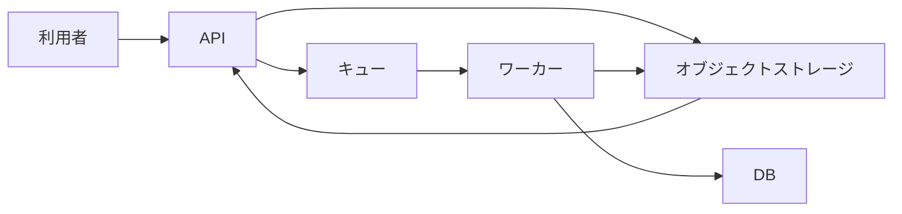

# ファイル取込の設計

ファイル本体をオブジェクトストレージに保存し、保存先をキューでワーカーへ渡して解析結果をDBに保存する。10MBのファイルをキューへ直接載せず、APIと解析処理を非同期化する。

## 背景

ファイル解析をAPIの処理から分離するため、APIはファイルを保存して解析処理を登録し、ワーカーが保存済みのファイルを解析する。非同期化により、利用者が解析結果を確認できるまで遅延する。

## 目標と非目標

### 目標

- APIがファイル本体をオブジェクトストレージへ保存する。
- APIが保存先をキューへ登録する。
- ワーカーが保存先からファイルを読み、解析結果をDBへ保存する。
- ファイル保存に失敗した場合、APIが503を返し、キューへ登録しない。

### 非目標

ファイル保存後にキューへの登録が失敗した場合の回復方法は、この資料では決定しない。

## 設計

### APIの処理

1. APIがファイルをオブジェクトストレージへ保存する。
2. 保存に失敗した場合、APIは503を返す。この場合、APIは保存先をキューへ登録しない。
3. 保存に成功した場合、APIは保存先をキューへ登録する。

ファイル本体はキューへ登録しない。10MBのファイルがキューの1MB制限を超えるためである。

### ワーカーの処理

1. ワーカーがキューから保存先を受け取る。
2. ワーカーが保存先からファイルを読み込む。
3. ワーカーがファイルを解析する。
4. ワーカーが解析結果をDBへ保存する。

### データの流れ

## 代替案と不採用理由

ファイル本体をキューへ登録する案は採用しない。10MBのファイルがキューの1MB制限を超えるためである。保存先だけをキューへ登録し、ワーカーがオブジェクトストレージからファイル本体を読む。

## 影響

解析を非同期化するため、利用者への解析結果の提示は遅れる。ファイル本体をキューへ載せないため、キューには保存先を登録する。

## リスク

APIがオブジェクトストレージへの保存に成功した後、キューへの登録に失敗した場合の回復方法が未決定である。この場合の扱いは、追加で決定する必要がある。

## 到達範囲

### システムの到達範囲

API、オブジェクトストレージ、キュー、ワーカー、DBを対象とする。APIが保存先をキューへ登録し、ワーカーが解析結果をDBへ保存するまでを扱う。

### 手順の到達範囲

ファイル保存、保存先のキュー登録、ワーカーによる読み込み、解析結果のDB保存を扱う。キューへの登録失敗後の回復手順は未決定である。

## 可逆性

保存先をキューへ登録する方式を変更する場合の具体的な切り戻し方法は、資料で定められていない。