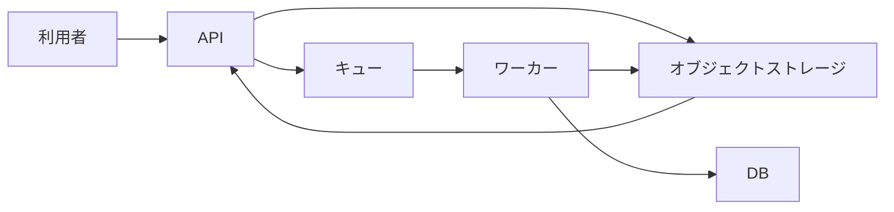

> **比較無効（2026-09-20）**: 「スキルなし」側にも tanteki の lint 指摘を返して修正させていたため、スキルの有無による比較としては無効です。表の条件名は実行時のラベルを残したもので、スキル非適用を保証しません。本文・判定・数値は検証用の記録です。

# Design Docの構成・失敗条件・代替案 — 1回目の文書レビュー

[一覧](../report.md) · [左右比較](../comparison.html#design-tradeoff.1)

これは単一モデルによる文書レビューで、正解ラベルではありません。引用の完全一致は機械検証しますが、指摘の解釈や重大度が正しいことは保証しません。原資料の不足と執筆上の欠陥を分け、見出し・表・短さだけでは判定しません。

## 原依頼・原資料

実装者向けにファイル取込のDesign Docを作成して。確定した資料: APIはファイルをオブジェクトストレージへ保存し、その保存先をキューへ登録する。保存に失敗したら503を返し、キューには登録しない。ワーカーは保存先から読み、解析結果をDBへ保存する。キューへの登録失敗時の回復方法は未決定。ファイル本体をキューに載せる案は、10MBのファイルがキューの1MB制限を超えるため不採用。非同期化で利用者への結果提示が遅れる。進行メモ: DATA-64、PR #203、今週はAPI実装、担当佐藤。

文書種別: Design Doc

読み手の視点: 実装者として、構成、処理とデータの流れ、重要な失敗条件、制約、不採用案の理由、未決定の範囲を理解できるかを読む。資料だけでは決まらない設計は確認事項とし、架空の実装詳細を要求しない。

## スキルなし

### レビュー

**文書の修正が必要**

構成、正常系、保存失敗時の動作、不採用理由は理解できる。ワーカーの失敗時の扱いも確認事項として明示する必要がある。キュー登録失敗時の回復やAPI契約などの確定には追加確認が必要。

想定用途: 実装者がファイル取込の構成、処理・データの流れ、失敗条件、制約、不採用理由、未決定事項を理解するためのDesign Doc。

#### 良い点

- API、オブジェクトストレージ、キュー、ワーカー、DBの責務とデータの流れが明確。
- 保存失敗時の503応答とキュー未登録、ファイル本体をキューに載せない理由を正確に保持している。
- キュー登録失敗時の回復を未決定と明示し、検討候補を採用済みの仕様と混同していない。

#### 指摘

**1. 要修正 — ワーカーによるファイル取得、解析、DB保存が失敗した場合の扱いは原資料にないが、本文でも確認事項として示されていない。**

根拠: 文書の用途

本文の該当箇所:

記載の欠落についての指摘。

原資料の該当箇所:

文書の用途に基づく指摘。

読み手への影響: 実装者がワーカーの重要な異常系に追加合意が必要だと把握できず、処理の失敗や結果の未保存への対応を独自に決めてしまうおそれがある。

修正案: ワーカーのファイル取得・解析・DB保存の失敗時の扱いを、実装前の確認事項に追加する。具体的な回復仕様は創作せず、要確認と明示する。

#### 原資料に足りない情報

**キュー登録失敗時の回復方針と、保存済みファイルの扱い。**

用途の達成を妨げる: はい · 本文で適切に扱う: はい

> 回復方法は未決定である。

保存には成功したが処理を開始できない場合の復旧動作を確定できない。

**保存先情報の形式、APIの成功応答、利用者による結果取得方法。**

用途の達成を妨げる: はい · 本文で適切に扱う: はい

> - キューへ登録する保存先情報の形式を定義する。
> - APIの受付成功レスポンスと結果取得方法を定義する。

API・ワーカー間および利用者向けのインターフェースを確定するには追加合意が必要。

**ワーカーによるファイル取得、解析、DB保存が失敗した場合の扱い。**

用途の達成を妨げる: はい · 本文で適切に扱う: いいえ

本文に対応する記載なし。

原資料に方針がなく、本文の確認事項にも明示されていないため、ワーカーの異常系を実装する前に確認が必要。

### 成果物の全文

[本文だけのMarkdown](../artifacts/design-tradeoff.1.without_skill.md)

---

# ファイル取込 Design Doc

## 1. 概要

ファイル取込は非同期処理として実装する。APIは受信したファイルをオブジェクトストレージへ保存し、保存先情報をキューへ登録する。ワーカーはキューから保存先情報を取得し、ファイルを読み込んで解析結果をDBへ保存する。

## 2. 背景・制約

- ファイル本体をキューへ登録する方式は採用しない。
- 10MBのファイルに対して、キューのサイズ上限が1MBであるため。
- 非同期化により、利用者が解析結果を確認するまでの時間は従来より長くなる。

## 3. 処理フロー

### API

1. APIがファイルを受信する。
2. ファイルをオブジェクトストレージへ保存する。
3. 保存先情報をキューへ登録する。
4. 上記が完了したら、受付済みとしてレスポンスを返す。

### ワーカー

1. キューから保存先情報を取得する。
2. 保存先からファイル本体を読み込む。
3. ファイルを解析する。
4. 解析結果をDBへ保存する。

## 4. エラー処理

### オブジェクトストレージへの保存失敗

- APIは503を返す。
- キューには登録しない。

### キューへの登録失敗

回復方法は未決定である。実装前に、再試行、状態管理、運用による復旧などの方針を決定する。キュー登録に失敗した場合は、オブジェクトストレージ上のファイルを孤立させない仕組みも検討する。

## 5. データと責務

- オブジェクトストレージ: 受信したファイル本体を保持する。
- キュー: オブジェクトストレージ上の保存先情報を伝達する。ファイル本体は保持しない。
- ワーカー: ファイルの取得、解析、解析結果のDB保存を担当する。
- DB: 解析結果を保存する。

## 6. 実装前の確認事項

- キューへ登録する保存先情報の形式を定義する。
- APIの受付成功レスポンスと結果取得方法を定義する。
- 解析中、解析完了、解析失敗などの処理状態を管理するか決定する。
- キュー登録失敗時の回復方法を決定する。
- 非同期処理によって結果提示が遅れることを利用者へ伝える方法を決定する。

## 7. 今回のスコープ

今週はAPI実装を行う。担当は佐藤。課題およびレビュー状況は、進捗管理資料を参照する。

---

## スキルあり

### レビュー

**原資料の不足で利用に制限**

構成、処理順序、保存失敗時の挙動、不採用案の理由を理解できる。キュー登録失敗時の回復方法は適切に未決定と示されており、異常系を含む実装の確定には追加判断が必要。

想定用途: 実装者向けのファイル取込Design Doc

#### 良い点

- APIからストレージ、キュー、ワーカー、DBへの処理とデータの受け渡しが具体的に示されている。
- 保存失敗時の503応答とキュー未登録の条件を正確に記載している。
- 10MBのファイルとキューの1MB制限による不採用理由、非同期化による結果提示の遅延、未決定事項を明示している。

#### 指摘

指摘なし。

#### 原資料に足りない情報

**ストレージ保存成功後にキュー登録が失敗した場合の回復方法。**

用途の達成を妨げる: はい · 本文で適切に扱う: はい

> APIがオブジェクトストレージへの保存に成功した後、キューへの登録に失敗した場合の回復方法が未決定である。この場合の扱いは、追加で決定する必要がある。

正常系と保存失敗時の実装方針は理解できるが、保存済みファイルを解析処理へ確実につなぐ異常系の実装は、この資料だけでは確定できない。

### 成果物の全文

[本文だけのMarkdown](../artifacts/design-tradeoff.1.with_skill.md)

---

# ファイル取込の設計

ファイル本体をオブジェクトストレージに保存し、保存先をキューでワーカーへ渡して解析結果をDBに保存する。10MBのファイルをキューへ直接載せず、APIと解析処理を非同期化する。

## 背景

ファイル解析をAPIの処理から分離するため、APIはファイルを保存して解析処理を登録し、ワーカーが保存済みのファイルを解析する。非同期化により、利用者が解析結果を確認できるまで遅延する。

## 目標と非目標

### 目標

- APIがファイル本体をオブジェクトストレージへ保存する。
- APIが保存先をキューへ登録する。
- ワーカーが保存先からファイルを読み、解析結果をDBへ保存する。
- ファイル保存に失敗した場合、APIが503を返し、キューへ登録しない。

### 非目標

ファイル保存後にキューへの登録が失敗した場合の回復方法は、この資料では決定しない。

## 設計

### APIの処理

1. APIがファイルをオブジェクトストレージへ保存する。
2. 保存に失敗した場合、APIは503を返す。この場合、APIは保存先をキューへ登録しない。
3. 保存に成功した場合、APIは保存先をキューへ登録する。

ファイル本体はキューへ登録しない。10MBのファイルがキューの1MB制限を超えるためである。

### ワーカーの処理

1. ワーカーがキューから保存先を受け取る。
2. ワーカーが保存先からファイルを読み込む。
3. ワーカーがファイルを解析する。
4. ワーカーが解析結果をDBへ保存する。

### データの流れ

## 代替案と不採用理由

ファイル本体をキューへ登録する案は採用しない。10MBのファイルがキューの1MB制限を超えるためである。保存先だけをキューへ登録し、ワーカーがオブジェクトストレージからファイル本体を読む。

## 影響

解析を非同期化するため、利用者への解析結果の提示は遅れる。ファイル本体をキューへ載せないため、キューには保存先を登録する。

## リスク

APIがオブジェクトストレージへの保存に成功した後、キューへの登録に失敗した場合の回復方法が未決定である。この場合の扱いは、追加で決定する必要がある。

## 到達範囲

### システムの到達範囲

API、オブジェクトストレージ、キュー、ワーカー、DBを対象とする。APIが保存先をキューへ登録し、ワーカーが解析結果をDBへ保存するまでを扱う。

### 手順の到達範囲

ファイル保存、保存先のキュー登録、ワーカーによる読み込み、解析結果のDB保存を扱う。キューへの登録失敗後の回復手順は未決定である。

## 可逆性

保存先をキューへ登録する方式を変更する場合の具体的な切り戻し方法は、資料で定められていない。

---
