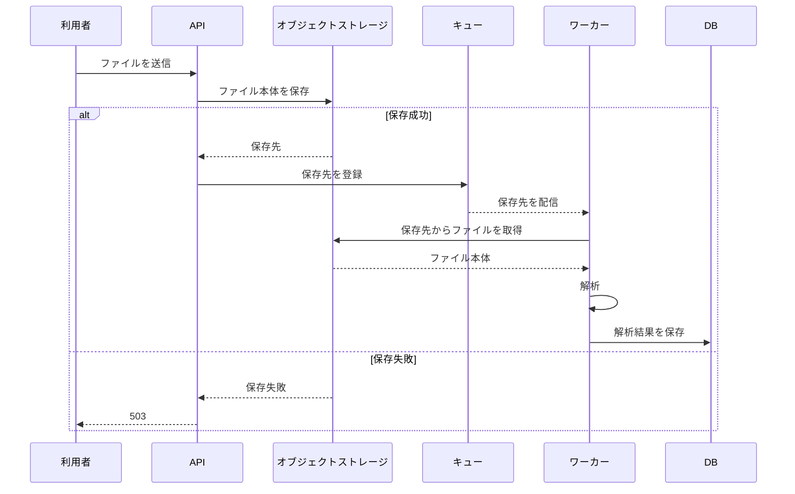

# ファイル取込 Design Doc

## 背景

ファイル取込をAPI処理と解析処理に分離する。APIはファイル本体をキューへ載せず、オブジェクトストレージに保存したファイルの保存先をキューへ登録する。ワーカーは保存先からファイルを読み、解析結果をDBへ保存する。

ファイル本体をキューへ載せる案は採用しない。10MBのファイルがキューの1MB制限を超えるためである。

## 目的と非目標

### 目的

- APIと解析処理を非同期化する。
- キューにはファイル本体ではなく保存先を渡す。
- 解析結果をDBに保存する。
- オブジェクトストレージへの保存失敗をAPIの503として返す。

### 非目標

- キューへの登録失敗時の回復方法をこの文書で決定する。
- 非同期化による結果提示の遅延を解消する。

## 設計

### 構成とデータの流れ

APIは受信したファイルをオブジェクトストレージへ保存する。保存に成功した場合だけ、その保存先をキューへ登録する。キューに登録された保存先をワーカーが読み取り、オブジェクトストレージからファイルを取得して解析し、解析結果をDBへ保存する。

### APIの失敗時動作

オブジェクトストレージへの保存に失敗した場合、APIは503を返し、キューには登録しない。保存成功後のキューへの登録に失敗した場合のAPI応答、再試行、保存済みファイルの扱いは未決定である。

## 代替案と不採用理由

ファイル本体をキューへ登録する案は不採用とする。10MBのファイルがキューの1MB制限を超えるためである。保存先だけを登録する方式では、ワーカーが保存先からファイルを取得できる。

## 影響

### 利点

- キューのメッセージサイズ制限を超えるファイルを扱える。
- APIと解析処理を分離できる。

### 負担と制約

- 利用者への解析結果の提示は、非同期化により遅れる。
- API、オブジェクトストレージ、キュー、ワーカー、DBの連携が必要になる。
- キューへの登録失敗時の回復方法が決まるまで、失敗時の動作を確定できない。

## 未解決点

キューへの登録に失敗した場合の回復方法を決定する必要がある。少なくとも、APIの応答、オブジェクトストレージに保存済みのファイルの扱い、再試行の方法を決める。

## 到達範囲と可逆性

### システムの到達範囲

本設計は、APIからオブジェクトストレージ、キュー、ワーカー、DBまでのファイル取込経路を対象とする。利用者へ解析結果を提示する画面や通知の方式は、資料に定義がないため対象外とする。

### 手順の到達範囲

実装時は、APIの保存処理、保存先のキュー登録、ワーカーの取得・解析・DB保存を順に実装する。保存失敗時の503とキュー未登録を確認する。キュー登録失敗時の回復方法が未決定のため、その動作確認は決定後に行う。

### 可逆性

ファイル本体をキューへ載せず保存先を登録する方式は、キュー登録失敗時の回復方法を決定するまで、失敗処理の詳細を追加できる。保存先の方式を変更する場合は、API、キュー、ワーカーの連携を変更する必要がある。