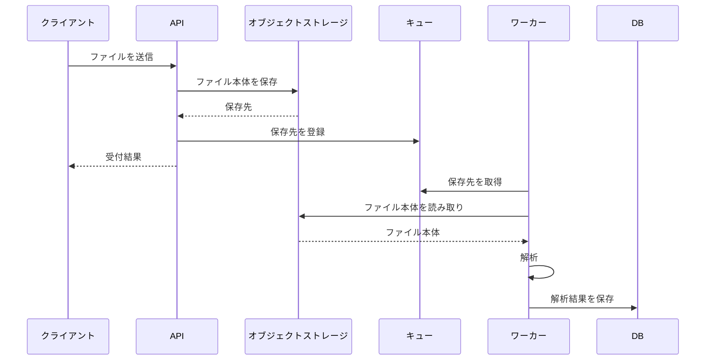

## ファイル取込の設計

### 背景

ファイル本体をキューへ載せる案は、10 MB のファイルがキューの 1 MB 制限を超えるため採用しない。ファイルを保存先と処理要求に分離し、API の応答後にワーカーが解析する。

### 目標と対象外

目標は、API で受け付けたファイルを非同期に解析し、解析結果を DB へ保存できる構成にすることである。

対象外は、キューへの登録失敗時の回復方法である。この扱いは未決定とする。

### 設計

処理の流れは次のとおりである。

#### API

1. API は受信したファイルをオブジェクトストレージへ保存する。
2. 保存に成功したら、保存先をキューへ登録する。
3. オブジェクトストレージへの保存に失敗した場合は、`503 Service Unavailable` を返す。この場合、キューには登録しない。

キューへの登録に失敗した場合の応答、保存済みファイルの扱い、再試行方法は未決定である。

#### ワーカー

1. ワーカーはキューから保存先を取得する。
2. 保存先からファイル本体を読み取る。
3. ファイルを解析する。
4. 解析結果を DB に保存する。

### 代替案

ファイル本体をキューへ登録する案は不採用とする。10 MB のファイルがキューの 1 MB 制限を超えるためである。保存先だけをキューへ登録する方式では、ワーカーが保存先からファイル本体を読み取れる。

### 影響

処理を非同期化するため、利用者が解析結果を確認できるまでの時間が長くなる。利用者への結果提示方法と、結果が確認可能になる条件は、この資料では定めない。

### リスク

キュー登録に失敗すると、保存済みファイルと処理要求の対応を失う可能性がある。回復方法は未決定である。実装前に扱いを決める必要がある。

### 未解決点

- キューへの登録失敗時に API が返すステータスと応答内容
- キューへの登録失敗時に保存済みファイルを残すかどうか
- キューへの登録を再試行する方法
- 保存済みファイルを処理要求へ復旧する方法
- 利用者へ解析結果を提示する方法

### 到達範囲

システムは、API によるファイル保存、保存先のキュー登録、ワーカーによるファイル取得・解析、解析結果の DB 保存までを対象とする。

手順は、API がファイルを受信してから、ワーカーが解析結果を DB に保存するまでを対象とする。キューへの登録失敗からの回復手順は、回復方法の決定後に追加する。

### 可逆性

ファイル本体をキューへ載せず、保存先をキューへ登録する方式は、ファイル本体の受け渡し方式を変更できる構成である。ただし、キューへの登録失敗時の回復方法が未決定のため、その影響を確認してから方式を見直す。