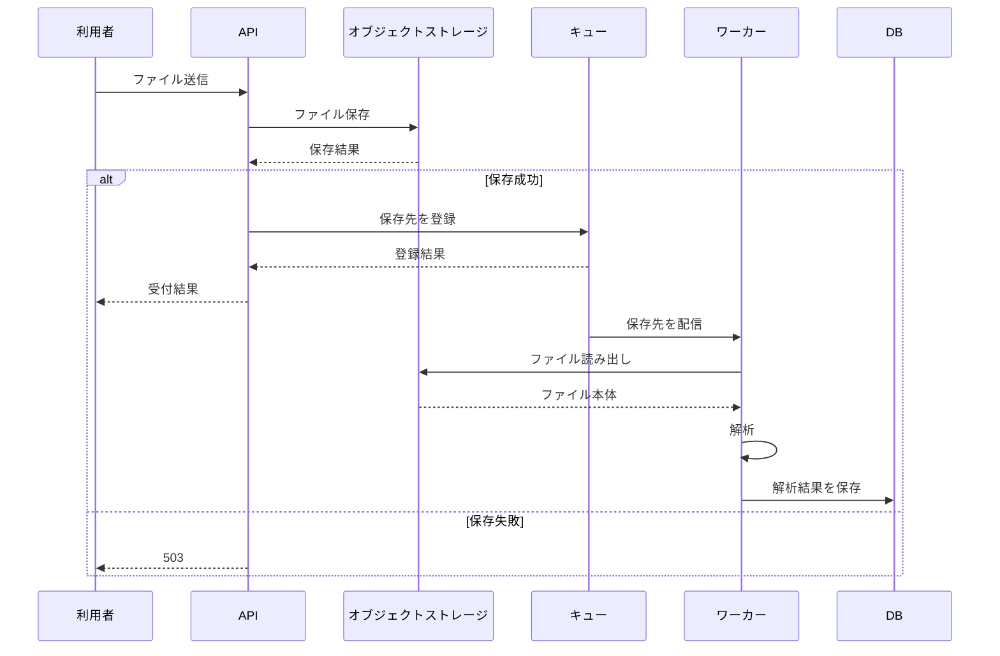

# ファイル取込 Design Doc

## 背景と目的

ファイル取込を同期処理から分離し、APIの受付とファイル解析を別の処理として実行する。APIはファイル本体をオブジェクトストレージへ保存し、保存先をキューへ登録する。ワーカーはキューに登録された保存先からファイルを読み、解析結果をDBへ保存する。

## スコープ

- APIによるファイル本体の受け付け
- オブジェクトストレージへのファイル保存
- 保存先のキュー登録
- ワーカーによるファイル読み出し
- 解析結果のDB保存
- 保存およびキュー登録に失敗した場合の扱い

## スコープ外

- キューへの登録失敗時の回復方法
- 解析結果を利用者へ提示する具体的な画面やAPI仕様

## 制約

キューのメッセージ上限は1MBである。取込対象には10MBのファイルがあるため、ファイル本体をキューへ載せる方式は上限を超える。キューにはファイル本体ではなく、オブジェクトストレージ上の保存先を登録する必要がある。

## 採用する設計

APIとワーカーを非同期に分離する。APIは次の順序で処理する。

1. 受け付けたファイルをオブジェクトストレージへ保存する。
2. 保存に成功した場合、保存先をキューへ登録する。
3. 保存に失敗した場合、503を返し、キューには登録しない。

キューから保存先を受け取ったワーカーは、保存先からファイル本体を読み出す。読み出したファイルを解析し、解析結果をDBへ保存する。

## 失敗時の動作

### オブジェクトストレージへの保存失敗

APIは503を返す。保存先をキューへ登録してはならない。したがって、保存できていないファイルをワーカーが処理することはない。

### キューへの登録失敗

オブジェクトストレージへの保存後にキュー登録が失敗した場合の回復方法は未決定である。保存済みファイルとキュー登録の不整合が発生し得るため、実装時に回復方法と状態管理を決定する必要がある。この決定が完了するまで、キュー登録成功をもって非同期処理へ進める条件を確定してはならない。

## 代替案と採否

ファイル本体をキューへ載せる案は不採用とする。10MBのファイルがキューの1MB制限を超えるためである。保存先をキューへ登録する方式なら、キューで扱うデータをファイル本体から保存先へ縮小できる。

## 影響

非同期化により、APIの受付完了から解析結果の提示までに遅延が生じる。利用者は、受付時点で解析結果を受け取れない。結果提示の具体的な方法と、キュー登録失敗時の回復方法は別途決定する必要がある。

## 未決定事項

- キューへの登録に失敗した場合の回復方法
- キュー登録失敗時にAPIが返す結果
- 解析結果を利用者へ提示する方法

## 根拠

本書は、確定したファイル取込資料に基づく。資料で確定していない事項は、未決定事項として記載した。