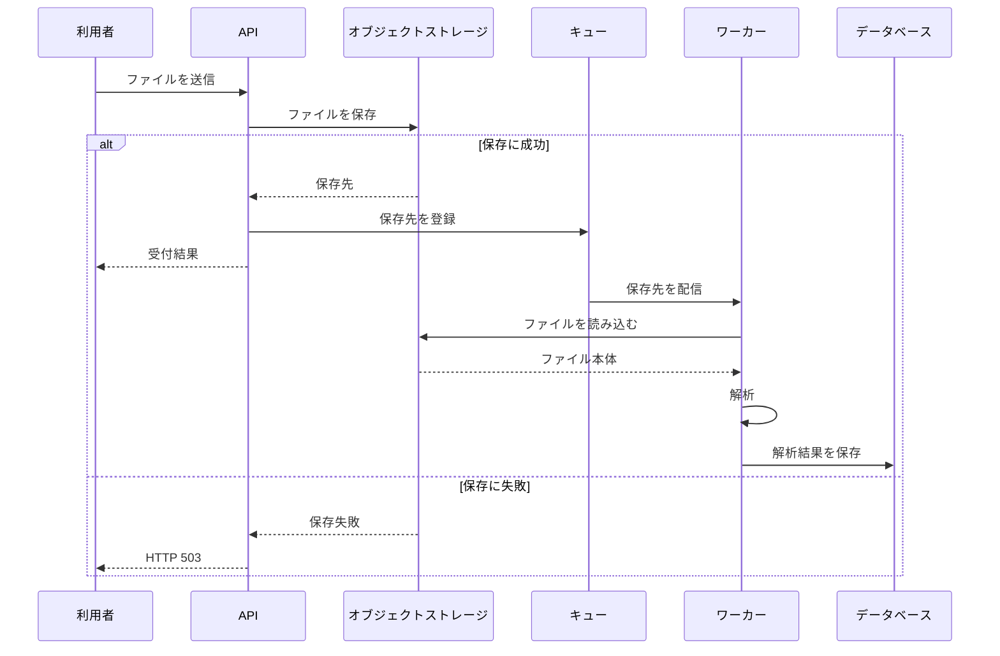

# ファイル取込 Design Doc

## 目的

APIで受け付けたファイルを非同期に解析し、解析結果をデータベースへ保存する。APIと解析処理を分離し、ファイル本体をキューへ載せずに処理する。

## 範囲

本設計の対象は、APIによるファイル受付から、ワーカーによる解析結果の保存までとする。利用者への結果提示方法、キューへの登録失敗時の回復方法は対象外とし、未決定事項として扱う。

## 決定事項と制約

- APIは受け付けたファイルをオブジェクトストレージへ保存する。
- APIは保存先をキューへ登録する。
- ワーカーはキューから保存先を受け取り、オブジェクトストレージからファイルを読み込む。
- ワーカーは解析結果をデータベースへ保存する。
- ファイル本体はキューへ登録しない。
- ファイル本体をキューへ載せる案は、10 MBのファイルがキューの1 MB制限を超えるため採用しない。

## 処理フロー

APIは、ファイル保存に成功した後で保存先をキューへ登録する。保存に失敗した場合はHTTP 503を返し、キューへ登録しない。保存成功後のキュー登録に失敗した場合の扱いは、現時点では決めない。

## 実装上の境界

### API

1. ファイルをオブジェクトストレージへ保存する。
2. 保存に失敗したらHTTP 503を返す。
3. 保存に失敗した場合はキューへ登録しない。
4. 保存に成功したら、ファイルの保存先をキューへ登録する。

APIの受付後、解析結果は非同期に保存される。そのため、利用者が結果を確認できるまでの時間は、同期処理より長くなる。

### キューのメッセージ

メッセージにはファイル本体を含めず、オブジェクトストレージ上の保存先を含める。ファイル本体を含めると、10 MBのファイルがキューの1 MB制限を超えるためである。

### ワーカー

ワーカーはキューの保存先を使ってオブジェクトストレージからファイルを読み込み、解析結果をデータベースへ保存する。解析処理はAPIのリクエスト処理とは分離して実行する。

## 失敗時の扱い

| 失敗箇所 | APIの応答 | キューへの登録 | 決定事項 |
|---|---|---|---|
| オブジェクトストレージへの保存 | HTTP 503 | 登録しない | 確定 |
| 保存先のキューへの登録 | 未決定 | 未決定 | 回復方法を決める |

保存成功後にキューへの登録が失敗すると、オブジェクトストレージ上にファイルが残ってもワーカーへ通知されない可能性がある。この状態からの回復方法は未決定であり、実装前に決める必要がある。

## 未決定事項

- 保存先のキューへの登録に失敗した場合の回復方法
- キュー登録失敗時にAPIが返す応答
- 非同期処理中および完了後の利用者への結果提示方法