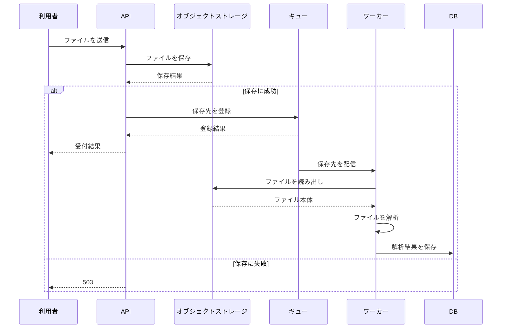

# ファイル取込の設計書

## 背景と目的

ファイル取込を同期処理から分離し、APIで受け付けたファイルを後続のワーカーが解析できる構成にする。APIはファイル本体をオブジェクトストレージへ保存し、保存先をキューへ登録する。ワーカーはキューから保存先を受け取り、オブジェクトストレージのファイルを読み、解析結果をDBへ保存する。

## 範囲と制約

対象は次の処理である。

- APIによるファイルの受け付け
- オブジェクトストレージへのファイル保存
- 保存先のキューへの登録
- ワーカーによるファイルの読み出しと解析
- 解析結果のDBへの保存

ファイル本体をキューへ登録する方式は採用しない。ファイルサイズが10MBの場合、キューの1MB制限を超えるためである。解析を非同期化するため、利用者が結果を確認できるまでの時間は同期処理より長くなる。

## 採用設計

### 処理の流れ

APIは、ファイルをオブジェクトストレージへ保存してから、保存先をキューへ登録する。オブジェクトストレージへの保存に失敗した場合は503を返し、キューへ登録しない。

ワーカーはキューから保存先を受け取り、保存先のファイルをオブジェクトストレージから読み出す。読み出したファイルを解析し、解析結果をDBへ保存する。

### 失敗時の扱い

オブジェクトストレージへの保存に失敗した場合、APIは503を返し、キューへの登録を行わない。したがって、保存できていないファイルをワーカーが処理することはない。

キューへの登録に失敗した場合の回復方法は未決定である。キューへの登録前に保存したファイルをどう扱うか、再登録を行うかは、この設計書では確定しない。

## 代替案と採否

### ファイル本体をキューへ登録する方式

この方式は採用しない。10MBのファイルはキューの1MB制限を超えるため、ファイルを登録できない。保存先だけをキューへ登録し、ファイル本体をオブジェクトストレージから読む方式を採用する。

## 影響

解析を非同期化するため、利用者への結果提示は遅くなる。APIの処理完了時点では解析結果がDBに保存されていない場合がある。

一方、ファイル本体はキューのサイズ制限を受けず、ワーカーがオブジェクトストレージから読み出して解析できる。オブジェクトストレージへの保存に失敗した場合は、APIが503を返し、処理対象をキューへ登録しない。

## 未決定事項

- キューへの登録に失敗した場合の回復方法
- キューへの登録前にオブジェクトストレージへ保存されたファイルの扱い
- 非同期処理の結果を利用者へ提示する方法

これらは実装の詳細または運用方法を確定する前に決める必要がある。特にキューへの登録失敗の回復方法は、保存済みファイルが解析されない状態をどう解消するかに関わる。