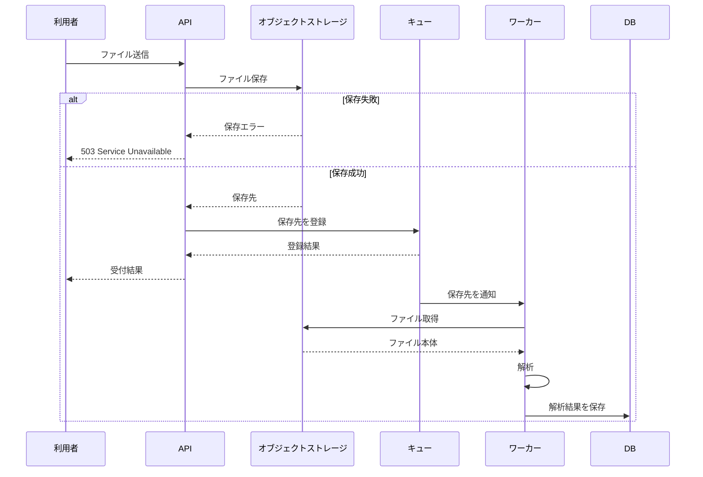

# ファイル取込の設計

## 1. 目的

APIで受け付けたファイルを非同期に解析し、解析結果をDBへ保存する。APIはファイル本体をキューへ送らず、オブジェクトストレージ上の保存先だけをキューへ登録する。

## 2. 範囲

対象は次の処理である。

- APIによるファイルの受け付け
- オブジェクトストレージへの保存
- 保存先のキューへの登録
- ワーカーによるファイル取得と解析
- 解析結果のDB保存

キューへの登録に失敗した場合の回復方法は未決定であり、本設計では扱わない。

## 3. 設計

### 3.1 構成

### 3.2 APIの処理

1. APIは受信したファイルをオブジェクトストレージへ保存する。
2. 保存に失敗した場合、APIは `503 Service Unavailable` を返す。この場合、キューには登録しない。
3. 保存に成功した場合、APIはオブジェクトストレージ上の保存先をキューへ登録する。
4. キューへの登録結果に応じた処理は、回復方法の決定後に確定する。

ファイル本体はキューへ登録しない。10MBのファイルがキューの1MB制限を超えるためである。

### 3.3 ワーカーの処理

1. ワーカーはキューから保存先を受け取る。
2. 保存先からオブジェクトストレージ上のファイルを読み込む。
3. ファイルを解析する。
4. 解析結果をDBへ保存する。

## 4. 失敗時の扱い

| 失敗箇所 | 確定した扱い |
|---|---|
| オブジェクトストレージへの保存 | APIは503を返す |
| 保存失敗後のキュー登録 | 登録しない |
| キューへの登録 | 回復方法は未決定 |

オブジェクトストレージへの保存成功後にキューへの登録が失敗した場合、保存済みファイルをどう扱うかは未決定である。再登録、保存済みファイルの削除、状態の記録などの具体的な方式は、この設計の確定対象外とする。

## 5. 採用しない方式

ファイル本体をキューへ載せる方式は採用しない。対象ファイルのサイズは10MBであり、キューの上限である1MBを超えるためである。保存先をキューへ載せる方式なら、ワーカーが必要なファイル本体をオブジェクトストレージから取得できる。

## 6. 利用者への影響

解析を非同期で実行するため、利用者が解析結果を確認できるまでの時間は、同期処理より遅くなる。結果の通知方法と、結果を確認できる状態の定義は本資料では未定義である。

## 7. 未決定事項

- オブジェクトストレージへの保存成功後、キューへの登録に失敗した場合の回復方法
- 非同期処理の受付結果と解析結果を利用者へ提示する方法
- 解析結果を確認できる状態の定義

これらは決定後に本設計へ反映する。

## 8. 実装上の確認点

- 保存失敗時に503を返すこと
- 保存失敗時にキューへ登録しないこと
- キューにはファイル本体ではなく保存先を登録すること
- ワーカーが保存先からファイルを取得すること
- 解析結果をDBへ保存すること
